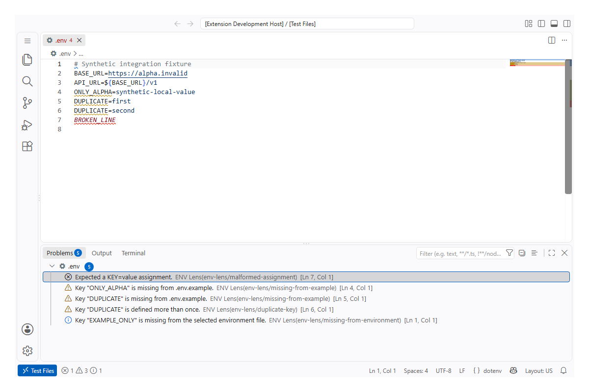

  

# ENV Lens

**Catch dotenv mistakes before they break your app.**

  
  
  

Validate `.env*` files and compare related environment files without exposing secret values.

## Highlights

- Diagnostics for invalid keys, malformed assignments, duplicate keys, quotes, and unresolved references.
- Drift checks between environment and example files.
- Safe actions that add missing key names with empty values.
- Completion, Go to Definition, and Document Symbols for `${KEY}` references.
- Desktop, web, remote, virtual-workspace, multi-root, and Restricted Mode support.

## Use

Open a dotenv file to see diagnostics. Run **ENV Lens: Compare with Example** to compare key names or **ENV Lens: Add Missing Keys to Example** to add empty placeholders.

ENV Lens never copies values, loads them into `process.env`, runs shell code, or sends file contents over the network. Requires VS Code 1.134 or newer.

More details: [product contract](docs/PDR.md) · [development](docs/development.md) · [dependencies](docs/dependencies.md)

---

  
  <a href="https://github.com/gvastethecreator"><picture><source media="(prefers-color-scheme: dark)" srcset="https://shieldcn.dev/badge/follow%20me-/gvastethecreator.png?size=xs&amp;logo=github&amp;brand=github&amp;mode=dark"></picture></a>
  <a href="https://github.com/sponsors/gvastethecreator"><picture><source media="(prefers-color-scheme: dark)" srcset="https://shieldcn.dev/badge/support%20this-project.png?size=xs&amp;logo=ri%3APiHeartFill&amp;logoColor=b85a90&amp;brand=github&amp;mode=dark"></picture></a>

